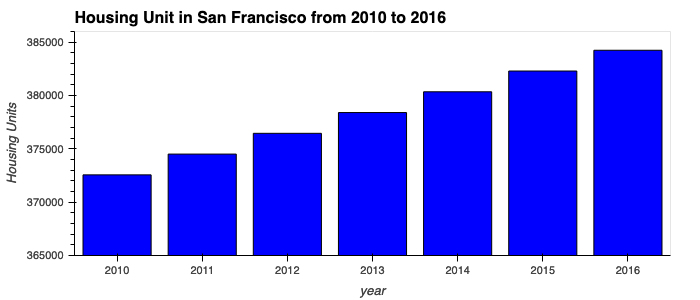
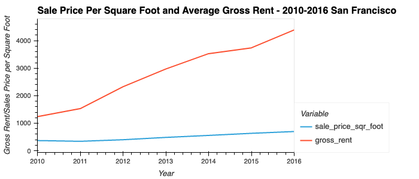
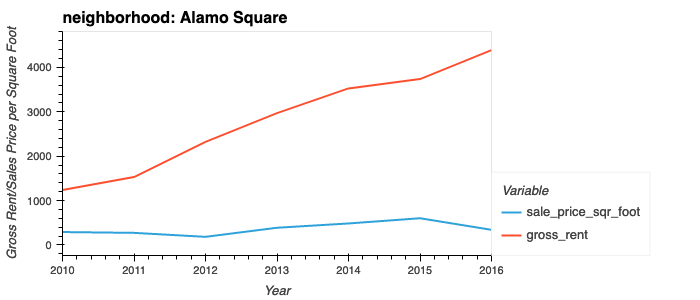
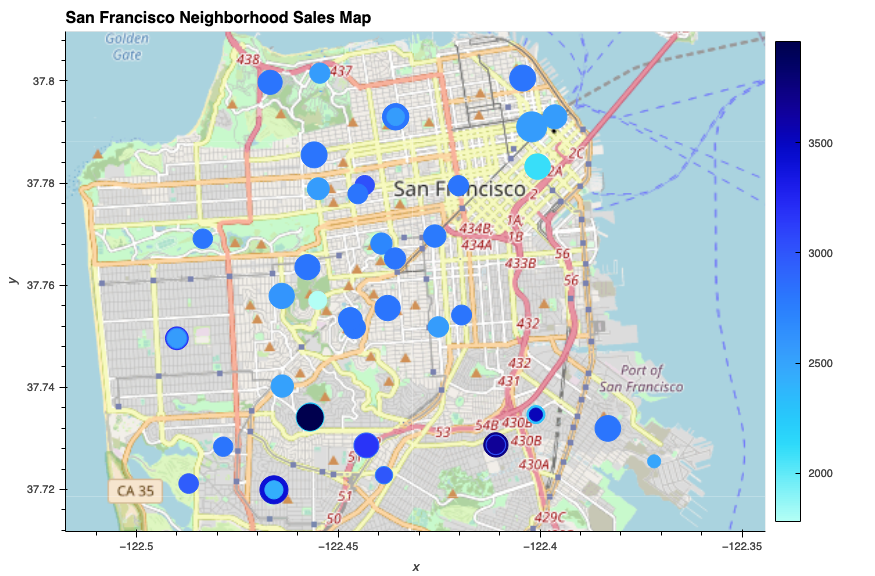

# Housing Rental Analysis

<b>Proptech</b>, the application of technology to real-estate markets, is an innovative domain in the fintech industry. Assume that you’re an analyst at a proptech company that wants to offer an instant, one-click service for people to buy properties and then rent them. The company wants to have a trial of this offering in the San Francisco real-estate market. If the service proves popular, they can then expand to other markets.

In this project, I utilize the `hvplot` tool to visualize and analyze the real-estate data in the San Francisco neighborhood. 

The following plot shows the housing units in San Francisco from 2010 to 2016:

The housing units keep increasing from 2010 to 2016. 

This plot shows the sale price per square foot and average gross rent in the San Francisco neighborhood from 2010 to 2016:

We can also compare the average sale prices by neighborhood. This plot shows the per square foot and average gross rent for the neighborhood Alamo Square from 2010 to 2016:

The data for other neighborhood can be shown interactively in the jupyter notebook. 

This plot shows the San Francisco Neighborhood sales map. The size of the circles represents the sale price per square foot. The color represents the gross rent. 

The sale price was largely unchanged from 2010 to 2016 while the rental income growth increased by over 40% during the same period. The same trend holds true for all the neighborhoods across San Francisco. 

The rental income increased significantly from 2010 to 2016 while the sale price per square foot remained unchanged, so it is profitable to invest in real estate in the San Francisco neighborhood. There are neighborhoods with relatively high rental income and low sale price, such as Silver Terrace, that are worth investigating. 